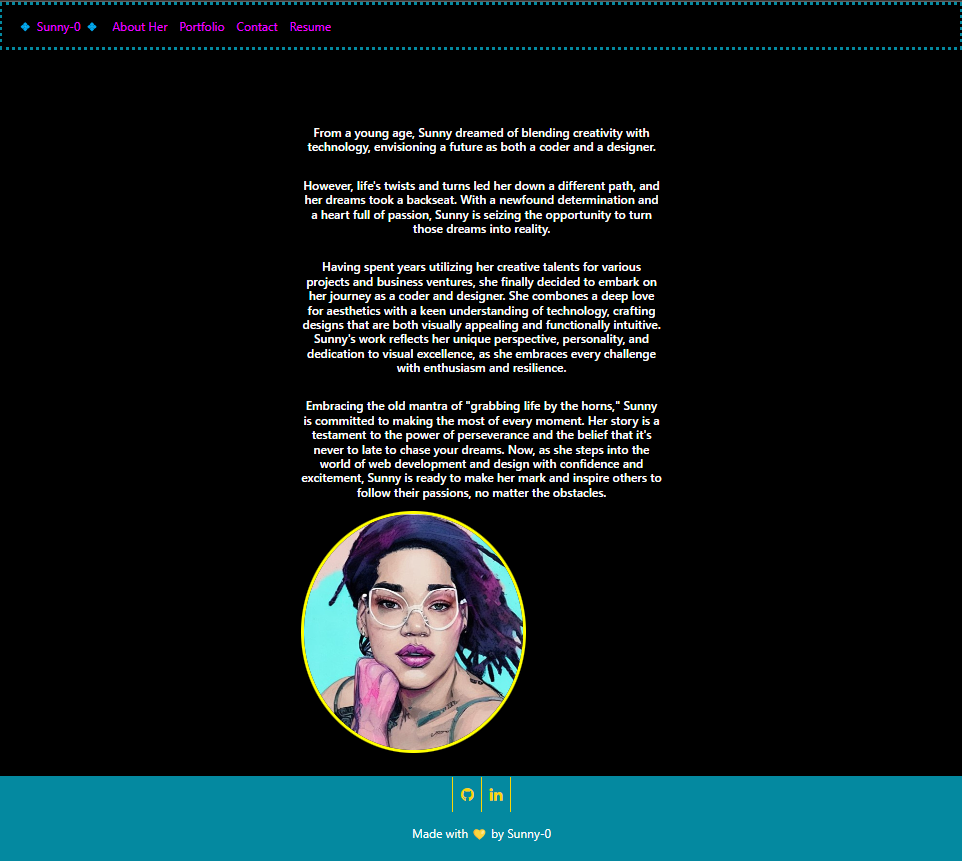

# React-Portfolio

## Table of Contents

- [Description](#description) 
- [Links](#links) 
- [Visuals](#visuals) 
- [Development](#development)
- [License](#license) 
- [Questions](#Questions) 

## Description

A portfolio made by yours truly to showcase projects that have been completed during my Full Stack Web Development course.  
I hope you enjoy a walk into my world. 💛

## Links

<a href="https://github.com/0-Sunny-0/React-Portfolio">Github Repo Link</a> 
<a href="https://sunnylebunzportfolio.netlify.app/">Sunny's Portfolio Website</a> 

## Visuals

## Development

- Need to alter the CSS for footer and text container placement on two pages.
- Add logic for contact form to send me an email once the form is filled out.

## License

 
This application is covered under the MIT license

## Questions

  If you have any questions regarding this application or repo, please open an issue or email me at msafinch@gmail.com 
  You can also find more of my work by visiting http://github.com/0-Sunny-0. 
